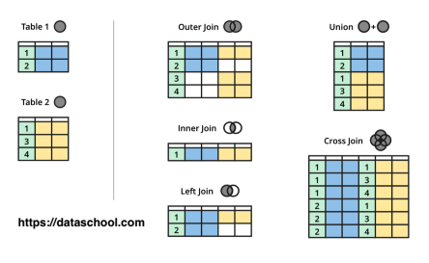

**SQL Join**<br>
Every table in the database needs to have a single theme

<br>

```console
[~]$ mysql -u root -p
Enter password: 1111
```

```console
MariaDB [(none)]> CREATE USER 'sql'@'localhost' IDENTIFIED BY '1111';
Query OK, 0 rows affected (0.022 sec)

MariaDB [(none)]> CREATE DATABASE sqldb CHARACTER SET utf8 COLLATE utf8_general_ci;
Query OK, 1 row affected (0.065 sec)

MariaDB [(none)]> GRANT ALL ON sqldb.* TO 'sql'@'localhost';
Query OK, 0 rows affected (0.013 sec)
```

<br>

[SQL ddl & data](https://github.com/egoing/sql-join/blob/master/dump.sql)

<br>



<br>

1. LEFT JOIN *⭐*

2. INNER JOIN

3. FULL OUTER JOIN

4. EXCULUSIVE JOIN

<br>

[*생활코딩*](https://youtube.com/playlist?list=PLuHgQVnccGMAG1O1BRZCT3wkD_aPmPylq)
