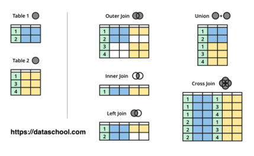

**SQL Join**<br>
Every table in the database needs to have a single theme

<br>

```console
[~]$ mysql -u root -p
Enter password: 1111
```

```console
MariaDB [(none)]> CREATE USER 'sql'@'localhost' IDENTIFIED BY '1111';
Query OK, 0 rows affected (0.022 sec)

MariaDB [(none)]> CREATE DATABASE sqldb CHARACTER SET utf8 COLLATE utf8_general_ci;
Query OK, 1 row affected (0.065 sec)

MariaDB [(none)]> GRANT ALL ON sqldb.* TO 'sql'@'localhost';
Query OK, 0 rows affected (0.013 sec)
```

<br>

[SQL ddl & data](https://github.com/egoing/sql-join/blob/master/dump.sql)

<br>



<br>

**1. LEFT *OUTER* JOIN** ⭐⭐<br>
*1-1. SELECT * FROM topic LEFT JOIN author ON topic.author_id = author.aid*
- topic 테이블을 왼쪽에 놓고 author 테이블을 오른쪽에 놓음<br>
- topic 테이블의 author_id와 author 테이블의 aid의 값이 같음<br>
- 참고해서 두개의 테이블을 하나로 만듦<br>
```sql
MariaDB [sqldb]> select * from topic left join author on topic.author_id = author.aid;
+-----+------------+------------------+-----------+------+---------+-------+------------+
| tid | title      | description      | author_id | aid  | name    | city  | profile_id |
+-----+------------+------------------+-----------+------+---------+-------+------------+
|   1 | HTML       | HTML is ...      | 1         |    1 | egoing  | seoul |          1 |
|   2 | CSS        | CSS is ...       | 2         |    2 | leezche | jeju  |          2 |
|   3 | JavaScript | JavaScript is .. | 1         |    1 | egoing  | seoul |          1 |
|   4 | Database   | Database is ...  | NULL      | NULL | NULL    | NULL  |       NULL |
+-----+------------+------------------+-----------+------+---------+-------+------------+
```
<br>

*1-2. SELECT * FROM topic LEFT JOIN author ON topic.author_id = author.aid LEFT JOIN profile ON author.profile_id = profile.pid*
```sql
MariaDB [sqldb]> select * from topic left join author on topic.author_id = author.aid left join profile on author.profile_id = profile.pid;
+-----+------------+------------------+-----------+------+---------+-------+------------+------+-----------+------------------+
| tid | title      | description      | author_id | aid  | name    | city  | profile_id | pid  | title     | description      |
+-----+------------+------------------+-----------+------+---------+-------+------------+------+-----------+------------------+
|   1 | HTML       | HTML is ...      | 1         |    1 | egoing  | seoul |          1 |    1 | developer | developer is ... |
|   2 | CSS        | CSS is ...       | 2         |    2 | leezche | jeju  |          2 |    2 | designer  | designer is ..   |
|   3 | JavaScript | JavaScript is .. | 1         |    1 | egoing  | seoul |          1 |    1 | developer | developer is ... |
|   4 | Database   | Database is ...  | NULL      | NULL | NULL    | NULL  |       NULL | NULL | NULL      | NULL             |
+-----+------------+------------------+-----------+------+---------+-------+------------+------+-----------+------------------+
```
<br>

*1-3. SELECT tid, topic.title, author_id, name, profile.title AS job_title FROM topic LEFT JOIN author ON topic.author_id = author.aid LEFT JOIN profile ON author.profile_id = profile.pid*
- topic 테이블에 title이 있고 profile 테이블에도 title이 있기 때문에 *테이블이름.title*<br>
- profile.title에 이름/별명을 붙여 주고 싶으면 *profile.title as 이름/별명*
```sql
MariaDB [sqldb]> select tid, topic.title, author_id, name, profile.title as job_title from topic left join author on topic.author_id = author.aid left join profile on author.profile_id = profile.pid;
+-----+------------+-----------+---------+-----------+
| tid | title      | author_id | name    | job_title |
+-----+------------+-----------+---------+-----------+
|   1 | HTML       | 1         | egoing  | developer |
|   2 | CSS        | 2         | leezche | designer  |
|   3 | JavaScript | 1         | egoing  | developer |
|   4 | Database   | NULL      | NULL    | NULL      |
+-----+------------+-----------+---------+-----------+
```
<br>

*1-4. SELECT tid, topic.title, author_id, name, profile.title AS job_title FROM topic LEFT JOIN author ON topic.author_id = author.aid LEFT JOIN profile ON author.profile_id = profile.pid WHERE aid = 1*
- aid가 1인 것만을 보고 싶으면 *where aid = 1*
```sql
MariaDB [sqldb]> select tid, topic.title, author_id, name, profile.title as job_title from topic left join author on topic.author_id = author.aid left join profile on author.profile_id = profile.pid where aid = 1;
+-----+------------+-----------+--------+-----------+
| tid | title      | author_id | name   | job_title |
+-----+------------+-----------+--------+-----------+
|   1 | HTML       | 1         | egoing | developer |
|   3 | JavaScript | 1         | egoing | developer |
+-----+------------+-----------+--------+-----------+
```
<br>

*1-5. RIGHT OUTER JOIN은 기준이 오른쪽에 있는 테이블*

<br>

**2. *INNER* JOIN** ⭐<br>
- left, right, outer가 없으면 *inner* join
- 모든 테이블에 존재하는 값으로 테이블을 만듦 (null 값이 존재하지 않음)

*2-1. SELECT * FROM topic INNER JOIN author ON topic.author_id = author.aid*
```sql
MariaDB [sqldb]> select * from topic inner join author on topic.author_id = author.aid;
+-----+------------+------------------+-----------+-----+---------+-------+------------+
| tid | title      | description      | author_id | aid | name    | city  | profile_id |
+-----+------------+------------------+-----------+-----+---------+-------+------------+
|   1 | HTML       | HTML is ...      | 1         |   1 | egoing  | seoul |          1 |
|   2 | CSS        | CSS is ...       | 2         |   2 | leezche | jeju  |          2 |
|   3 | JavaScript | JavaScript is .. | 1         |   1 | egoing  | seoul |          1 |
+-----+------------+------------------+-----------+-----+---------+-------+------------+

MariaDB [sqldb]> select * from topic join author on topic.author_id = author.aid;
+-----+------------+------------------+-----------+-----+---------+-------+------------+
| tid | title      | description      | author_id | aid | name    | city  | profile_id |
+-----+------------+------------------+-----------+-----+---------+-------+------------+
|   1 | HTML       | HTML is ...      | 1         |   1 | egoing  | seoul |          1 |
|   2 | CSS        | CSS is ...       | 2         |   2 | leezche | jeju  |          2 |
|   3 | JavaScript | JavaScript is .. | 1         |   1 | egoing  | seoul |          1 |
+-----+------------+------------------+-----------+-----+---------+-------+------------+
```
<br>

*2-2. SELECT * FROM topic INNER JOIN author ON topic.author_id = author.id INNER JOIN profile ON profile.pid = author.profile_id*
```sql
MariaDB [sqldb]> select * from topic join author on topic.author_id = author.aid join profile on profile.pid = author.profile_id;
+-----+------------+------------------+-----------+-----+---------+-------+------------+-----+-----------+------------------+
| tid | title      | description      | author_id | aid | name    | city  | profile_id | pid | title     | description      |
+-----+------------+------------------+-----------+-----+---------+-------+------------+-----+-----------+------------------+
|   1 | HTML       | HTML is ...      | 1         |   1 | egoing  | seoul |          1 |   1 | developer | developer is ... |
|   3 | JavaScript | JavaScript is .. | 1         |   1 | egoing  | seoul |          1 |   1 | developer | developer is ... |
|   2 | CSS        | CSS is ...       | 2         |   2 | leezche | jeju  |          2 |   2 | designer  | designer is ..   |
+-----+------------+------------------+-----------+-----+---------+-------+------------+-----+-----------+------------------+
```

<br>

**3. FULL OUTER JOIN**<br>
- 모든 테이블의 모든 값으로 테이블을 만듦
- left *outer* join과 right *outer* join을 합쳐서(union distinct) 중복되는 것을 제거한 것

*3-1. SELECT * FROM topic FULL OUTER JOIN author ON topic.author_id = author.id<br>
(SELECT * FROM topic LEFT JOIN author ON topic.author_id = author.id) UNION (SELECT * FROM topic RIGHT JOIN author ON topic.author_id = author.id)*
```sql
MariaDB [sqldb]> select * from topic left join author on topic.author_id = author.aid union select * from topic right join author on topic.author_id = author.aid;
+------+------------+------------------+-----------+------+----------+--------+------------+
| tid  | title      | description      | author_id | aid  | name     | city   | profile_id |
+------+------------+------------------+-----------+------+----------+--------+------------+
|    1 | HTML       | HTML is ...      | 1         |    1 | egoing   | seoul  |          1 |
|    2 | CSS        | CSS is ...       | 2         |    2 | leezche  | jeju   |          2 |
|    3 | JavaScript | JavaScript is .. | 1         |    1 | egoing   | seoul  |          1 |
|    4 | Database   | Database is ...  | NULL      | NULL | NULL     | NULL   |       NULL |
| NULL | NULL       | NULL             | NULL      |    3 | blackdew | namhae |          3 |
+------+------------+------------------+-----------+------+----------+--------+------------+
```

<br>

**4. EXCULUSIVE JOIN**<br>
- 한개의 테이블에만 존재하는 값으로 테이블을 만듦

*4-1. SELECT * FROM topic LEFT JOIN author ON topic.author_id = author.aid WHERE author.aid is NULL*
```sql
MariaDB [sqldb]> select * from topic left join author on topic.author_id = author.aid where author.aid is null;
+-----+----------+-----------------+-----------+------+------+------+------------+
| tid | title    | description     | author_id | aid  | name | city | profile_id |
+-----+----------+-----------------+-----------+------+------+------+------------+
|   4 | Database | Database is ... | NULL      | NULL | NULL | NULL |       NULL |
+-----+----------+-----------------+-----------+------+------+------+------------+
```

<br>

[*생활코딩*](https://youtube.com/playlist?list=PLuHgQVnccGMAG1O1BRZCT3wkD_aPmPylq)
